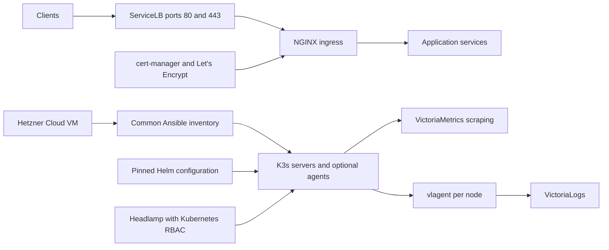

# AK3S

AK3S installs a lightweight, self-managed Kubernetes platform on your existing Hetzner Cloud VM. It provides the core cluster, ingress, HTTPS, dashboard, metrics, and logging experience using open-source components. Hetzner Cloud is the only supported infrastructure provider for now. Ansible prepares the host and installs K3s; Helm installs the platform components.

| Capability | Component |
| --- | --- |
| Kubernetes and runtime | K3s and containerd |
| Networking and DNS | Flannel, kube-proxy, CoreDNS |
| Service exposure | K3s ServiceLB |
| Ingress | NGINX Kubernetes Ingress Controller, open-source edition |
| HTTPS certificates | cert-manager and Let's Encrypt |
| Kubernetes UI | Headlamp |
| Metrics | Single-node VictoriaMetrics with built-in scraping |
| Logs | Single-node VictoriaLogs and a vlagent collector per node |
| Resource metrics and storage | K3s metrics-server and local-path provisioner |

Traefik is disabled during K3s installation. AK3S uses the [NGINX-maintained controller](https://github.com/nginx/kubernetes-ingress), whose annotations start with `nginx.org/`. The Kubernetes community `ingress-nginx` project is a different controller.

## Quick start

Start inside your clean Hetzner VM running Ubuntu 24.04 or Debian 12+, with systemd and swap disabled. x86_64 and arm64 are supported. A 2-vCPU, 4-GB RAM server with at least 40 GB of SSD storage is a practical starting point for the platform and small workloads; workload and log volume determine actual requirements. Check the [Hetzner firewall requirements](docs/hetzner.md#firewall-requirements) before exposing applications.

### Installing from inside the Hetzner VM

Put the repository on the VM, enter a root shell with `sudo -i`, and install the controller tools:

```bash
apt-get update
apt-get install -y python3 python3-venv make curl ca-certificates
curl -fsSL https://raw.githubusercontent.com/helm/helm/v3.19.0/scripts/get-helm-3 -o /tmp/ak3s-get-helm.sh
DESIRED_VERSION=v3.19.0 bash /tmp/ak3s-get-helm.sh
```

The Helm installer is from the pinned upstream release and verifies the downloaded Helm archive checksum. From the repository root:

```bash
make setup
cp examples/inventory-local.yaml inventory.yaml
cp examples/cluster.yaml cluster.yaml
# Set both inventory addresses and api_endpoint to the VM's public IPv4.
# Set acme_email to your email address.
make install
export KUBECONFIG="$PWD/.ak3s/kubeconfig"
make status
```

`make install` validates configuration, prepares the host, installs the pinned K3s release with Traefik disabled and secret encryption enabled, retrieves a private administrator kubeconfig, and installs the platform components and dashboard access roles. K3s supplies kubectl. Repeat the command to reconcile configuration. Installation refuses to overwrite a K3s installation it does not own.

The local inventory uses `ansible_connection: local`, so Ansible configures the VM without connecting to it over SSH. To add the platform to a manually installed K3s cluster with Traefik disabled, use `.venv/bin/python scripts/ak3s.py platform --config cluster.yaml --kubeconfig /etc/rancher/k3s/k3s.yaml` as root.

### Installing from a workstation

On your workstation, install Python 3.11+, its venv package, Helm 3.19+, kubectl compatible with the pinned Kubernetes release, make, and an SSH client. The VM needs Python 3 and root access or passwordless sudo. Then:

```bash
make setup
cp examples/inventory.yaml inventory.yaml
cp examples/cluster.yaml cluster.yaml
# Edit the inventory addresses, api_endpoint, and acme_email.
# Verify the SSH host key and log in once before installation.
make install
export KUBECONFIG="$PWD/.ak3s/kubeconfig"
make status
```

Installation uses the VM you provide and does not require a Hetzner API token. `make bootstrap` and `make platform` remain available to run host configuration and platform updates separately.

Point an application DNS A record at the ingress node's public IPv4 address and allow inbound TCP 80/443. Edit the hostname in [examples/app.yaml](examples/app.yaml), then deploy it:

```bash
kubectl apply -f examples/app.yaml
kubectl -n demo get certificate,order,challenge
```

The example uses Let's Encrypt staging, whose certificates are intentionally untrusted by browsers. Once issuance works, change the Ingress issuer annotation to `letsencrypt-production` and enable `nginx.org/ssl-redirect: "true"`. Both issuers are installed; `acme_environment` selects the issuer for the optional Headlamp ingress.

Headlamp, metrics, and logs are private ClusterIP services by default. Access them using the commands in [operations](docs/operations.md), which also covers token login, upgrades, persistence, recovery, and verification.

## Architecture and boundaries



A single server uses the K3s default SQLite datastore. An odd number of at least three servers uses embedded etcd. Optional agents use the same installation workflow. Read [architecture](docs/architecture.md) before expanding a cluster: network trust, API availability, storage locality, and ingress DNS need deliberate configuration.

AK3S is self-managed. Operators handle node lifecycle, upgrades, backup and restore, identity, capacity, and availability. There is no cloud autoscaler, replicated storage, external cloud load balancer, registry, GitOps controller, or backup operator in the baseline. Kubernetes RBAC and short-lived tokens provide UI authentication; an external identity provider can be integrated separately when required.

## Repository and validation

| Path | Purpose |
| --- | --- |
| `docs/hetzner.md` | Requirements and firewall setup for your existing Hetzner VM |
| `ansible/` | Common host preparation and K3s configuration |
| `platform/versions.yaml` | K3s, installer checksum, and Helm release pins |
| `platform/values/` | Small, reviewable Helm overrides |
| `platform/manifests/` | Shared Kubernetes access roles |
| `scripts/ak3s.py` | Configuration validation, bootstrap, platform install, rendering, and status |
| `examples/` | Inventory, settings, and HTTPS application |
| `tests/` | Configuration and isolation checks plus disposable-cluster smoke test |

```bash
make test
.venv/bin/python scripts/ak3s.py render --config examples/cluster.yaml
# Docker, Helm, kubectl, curl, and Python dependencies required:
tests/smoke.sh
```

Custom file locations are supported through `--config`, `--inventory`, and `--state-dir`. Platform and status also accept `--kubeconfig` for an explicitly selected existing K3s cluster. Rendering fetches charts and validates their templates without contacting a cluster. The CI workflow runs unit tests, Ansible syntax checks, and a disposable K3s platform smoke test.

AK3S is licensed under [MIT](LICENSE). Upstream components retain their own licenses.
